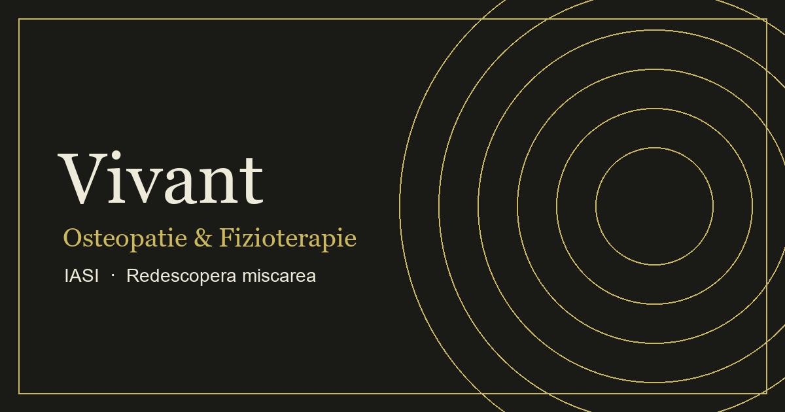

# Vivant Osteo & Physio — Site de prezentare

**Live: [www.vivantop.ro](https://www.vivantop.ro)**

Site de prezentare bilingv (RO/EN) pentru o clinică de osteopatie și fizioterapie din Iași.
Construit integral în **vanilla HTML/CSS/JavaScript** — fără framework-uri, fără build tools, fără dependențe JS externe. Tot site-ul are sub **400 KB**.



---

## Ce e interesant tehnic

### 🌍 Motor i18n propriu
- ~550 de noduri traduse RO/EN, comutare **fără reload** de pagină
- Traduce text (`data-i18n`), HTML (`data-i18n-html`), atribute (`data-i18n-attr`) și `<title>` (`data-i18n-title`)
- Persistență în `localStorage`; prima vizită e întotdeauna în română, indiferent de limba browserului
- Chiar și link-urile externe sunt bilingve — mesajul pre-completat din WhatsApp se schimbă cu limba

### ♿ Componente custom accesibile
- **Dropdown custom** pentru formular: navigare completă din tastatură (săgeți, Home/End, Escape), ARIA (`role="listbox"`, `aria-expanded`), iar pe ecrane tactile cade elegant înapoi pe `<select>`-ul nativ — UI-ul potrivit pe fiecare dispozitiv
- **Meniu drawer responsive** cu buton de închidere dedicat, `100dvh` pentru viewport-ul real de pe mobil și spațiere adaptivă pe ecrane scurte
- Label-uri plutitoare, validare client-side cu stări de eroare per câmp

### 🔍 SEO tehnic complet
- **JSON-LD** pe fiecare pagină: `MedicalClinic`/`LocalBusiness` (cu program, coordonate, prețuri), `FAQPage`, `BreadcrumbList`, `WebSite`, `Service`
- Canonical, Open Graph + Twitter Cards, imagine OG 1200×630, geo-tags, `sitemap.xml`, `robots.txt`
- Ancore pe secțiuni (`servicii.html#osteopatie`) cu `scroll-margin-top` pentru navbar-ul fix

### 📬 Integrări (toate fără backend propriu)
- **Formular de contact AJAX** prin Web3Forms: validare, honeypot anti-spam, stări de trimitere/succes/eroare, fallback demo până la configurarea cheii
- **Deep-links bilingve**: WhatsApp cu mesaj pre-completat, Google Maps cu destinația setată (navigație directă din aplicație)
- **Recenzii Google** afișate live prin widget Elfsight

### 🎨 Detalii de design
- Tranziții de culoare între secțiuni cu gradient **perceptual uniform** (`color-mix in oklab`, curbă smoothstep în 24 de trepte — zero banding)
- Navbar cu crossfade de logo la scroll, fade-in-uri pe `IntersectionObserver`, parallax subtil pe hero
- Dark/light logo variants cu fallback grațios dacă imaginea lipsește

### 🚀 Deploy
- Shared hosting (cPanel/Apache) — `.htaccess` cu redirect HTTPS + www canonic, GZIP, cache headers, headere de securitate (CSP, X-Frame-Options, HSTS)
- Pagină 404 brandată, favicon complet (ico/16/32/180/192/512) + webmanifest

## Stack

| | |
|---|---|
| **Frontend** | HTML5, CSS3 (custom properties, grid/flex, oklab), JavaScript ES6+ (vanilla) |
| **Formular** | Web3Forms (AJAX, fără backend) |
| **Hosting** | Shared hosting cPanel + Apache, SSL Let's Encrypt (AutoSSL) |
| **Tooling** | Zero build tools — codul sursă e codul livrat |

## Structura proiectului

```
├── index.html            # Homepage — hero, servicii, afecțiuni, recenzii, contact
├── despre.html           # Echipa și valorile clinicii
├── servicii.html         # 6 servicii cu ancore proprii (#osteopatie …)
├── afectiuni.html        # Afecțiuni tratate
├── preturi.html          # Prețuri (sincronizate cu JSON-LD)
├── faq.html              # FAQ cu acordeon + schema FAQPage
├── contact.html          # Formular, hartă, date de contact
├── 404.html              # Pagină de eroare brandată
├── style.css             # Tot stilul (~3000 linii, mobile-first)
├── main.js               # Interacțiuni: meniu, formular, scroll, dropdown custom
├── translations.js       # Dicționar RO/EN + motorul i18n
├── booking.js            # Modal de programare
├── reviews.js            # Integrare recenzii
├── .htaccess             # Redirecturi, cache, securitate
├── sitemap.xml / robots.txt
└── img/                  # Ilustrații SVG optimizate
```

## Rulare locală

Fără instalare, fără `npm install` — e nevoie doar de un server static:

```bash
python -m http.server 8000
# apoi deschide http://localhost:8000
```

---

**Dezvoltat de [Stefan Costin Apreotesei](https://github.com/StefanCostinApreotesei)** · Conținutul și identitatea vizuală aparțin Vivant Osteo & Physio.
